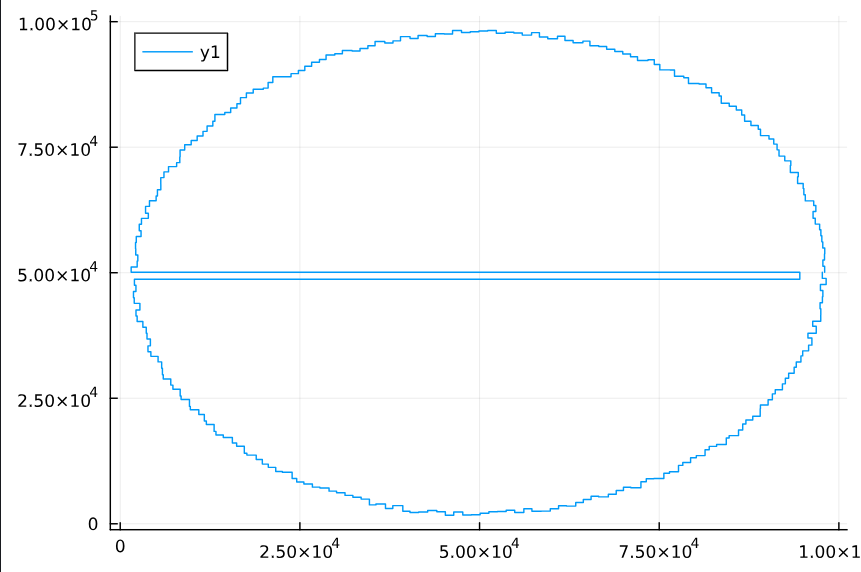

[Advent of Code](https://adventofcode.com/2025) 2025 in Julia!

### Day 1: 
```
BenchmarkTools.Trial: 10000 samples with 1 evaluation per sample.
 Range (min … max):  126.500 μs …  31.684 ms  ┊ GC (min … max): 0.00% … 0.00%
 Time  (median):     135.200 μs               ┊ GC (median):    0.00%
 Time  (mean ± σ):   179.488 μs ± 450.875 μs  ┊ GC (mean ± σ):  6.26% ± 3.88%
 Memory estimate: 133.44 KiB, allocs estimate: 4270.
```

### Day 2:
```
BenchmarkTools.Trial: 1 sample with 1 evaluation per sample.
 Single result which took 5.510 s (5.39% GC) to evaluate,
 with a memory estimate of 3.29 GiB, over 107258161 allocations.
```

### Day 03:
```
BenchmarkTools.Trial: 2 samples with 1 evaluation per sample.
 Range (min … max):  2.931 s …  2.945 s  ┊ GC (min … max): 8.87% … 7.59%
 Time  (median):     2.938 s             ┊ GC (median):    8.23%
 Time  (mean ± σ):   2.938 s ± 9.584 ms  ┊ GC (mean ± σ):  8.23% ± 0.91%
 Memory estimate: 2.31 GiB, allocs estimate: 65297762.
```

### Day 04:
```
BenchmarkTools.Trial: 397 samples with 1 evaluation per sample.
 Range (min … max):  10.371 ms … 28.309 ms  ┊ GC (min … max): 0.00% … 54.95%
 Time  (median):     12.089 ms              ┊ GC (median):    0.00%
 Time  (mean ± σ):   12.582 ms ±  2.279 ms  ┊ GC (mean ± σ):  6.34% ±  8.17%
 Memory estimate: 8.43 MiB, allocs estimate: 60233.
```

### Day 05
```
BenchmarkTools.Trial: 10000 samples with 1 evaluation per sample.
 Range (min … max):  163.900 μs …  19.129 ms  ┊ GC (min … max): 0.00% … 98.76%
 Time  (median):     171.200 μs               ┊ GC (median):    0.00%
 Time  (mean ± σ):   206.197 μs ± 297.919 μs  ┊ GC (mean ± σ):  1.87% ±  1.94%
 Memory estimate: 57.78 KiB, allocs estimate: 724.
```

### Day 06
```
BenchmarkTools.Trial: 7463 samples with 1 evaluation per sample.
 Range (min … max):  424.400 μs …  28.846 ms  ┊ GC (min … max):  0.00% … 98.09%
 Time  (median):     457.400 μs               ┊ GC (median):     0.00%
 Time  (mean ± σ):   665.915 μs ± 974.548 μs  ┊ GC (mean ± σ):  16.96% ± 11.87%
 Memory estimate: 971.01 KiB, allocs estimate: 14552.
```

### Day 07
```
BenchmarkTools.Trial: 2036 samples with 1 evaluation per sample.
 Range (min … max):  1.643 ms … 20.035 ms  ┊ GC (min … max):  0.00% … 90.14%
 Time  (median):     1.811 ms              ┊ GC (median):     0.00%
 Time  (mean ± σ):   2.450 ms ±  1.348 ms  ┊ GC (mean ± σ):  14.09% ± 18.28%
 Memory estimate: 4.13 MiB, allocs estimate: 30755.
```

### Day 08
```
BenchmarkTools.Trial: 111 samples with 1 evaluation per sample.
 Range (min … max):  38.750 ms … 60.810 ms  ┊ GC (min … max): 0.00% … 4.13%
 Time  (median):     43.787 ms              ┊ GC (median):    4.33%
 Time  (mean ± σ):   45.176 ms ±  4.106 ms  ┊ GC (mean ± σ):  4.36% ± 3.06%
 Memory estimate: 27.16 MiB, allocs estimate: 8023.
```

### Day 09
Longer than I care to measure. Currently, still waiting for part 2. Here is an image instead:


### Day 10
BenchmarkTools.Trial: 6 samples with 1 evaluation per sample.
 Range (min … max):  835.626 ms …    1.306 s  ┊ GC (min … max): 0.00% … 0.00%
 Time  (median):     894.003 ms               ┊ GC (median):    0.00%
 Time  (mean ± σ):   973.315 ms ± 179.565 ms  ┊ GC (mean ± σ):  0.00% ± 0.00%
 Memory estimate: 15.22 MiB, allocs estimate: 515654.

### Day 11
BenchmarkTools.Trial: 7547 samples with 1 evaluation per sample.
 Range (min … max):  470.600 μs …  27.867 ms  ┊ GC (min … max):  0.00% … 95.40%
 Time  (median):     496.500 μs               ┊ GC (median):     0.00%
 Time  (mean ± σ):   660.655 μs ± 779.076 μs  ┊ GC (mean ± σ):  12.11% ± 10.92%
 Memory estimate: 906.64 KiB, allocs estimate: 15391.